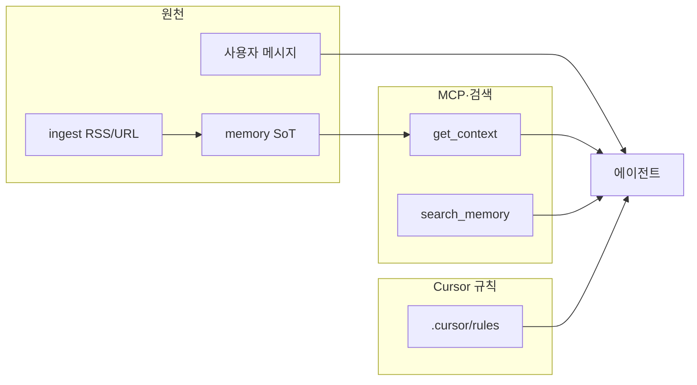
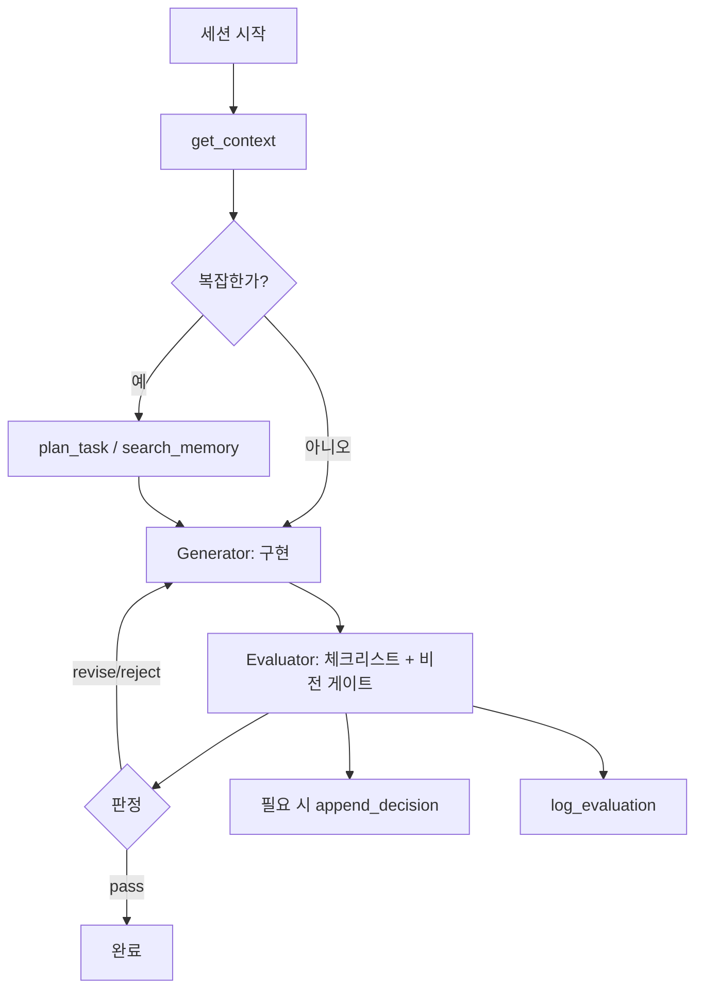

# Yohan OS — 컨텍스트 엔지니어링 · 하네스 엔지니어링 체계

프롬프트 한 줄을 넘어,**무엇이 언제 모델·에이전트에 들어가는지(컨텍스트)**와 **도구·절차·검증으로 행동을 고정하는지(하네스)**를 레포 안에서 **구조화**한 참조 문서다.

---

## 1. 세 층 비교

| 층              | 역할                                    | Yohan OS에서의 위치                                                                                                                 |
| -------------- | ------------------------------------- | ------------------------------------------------------------------------------------------------------------------------------ |
| **프롬프트**       | 당장 턴의 질문·지시                           | 사용자 메시지, 채팅 내 첨부                                                                                                               |
| **컨텍스트 엔지니어링** | “지금 이 작업에 필요한 사실·규칙·기억”을 **선택·압축·주입** | `memory/` SoT, MCP `get_context` / `search_memory`, 인제스트, `.cursor/rules/*.mdc` (파일/세션 스코프)                                    |
| **하네스 엔지니어링**  | **순서·도구·금지·검증**으로 출력을 신뢰 가능하게 묶음      | `memory/rules/agent-harness.md`, P/G/E(`pge-pipeline.md`), Evaluator 게이트, MCP `plan_task`·`append_decision`·`log_evaluation` 등 |

**원칙:** 컨텍스트는 “무엇을 아는가”, 하네스는 “어떤 순서와 제약으로 행동하는가”. 둘 다 없으면 프롬프트만으로는 재현성이 떨어진다.

### 1.1 하네스와 창의성 — 바닥은 지키고, 위는 유연하게

- 구조·틀·규칙·지침·기준은 **비전·방향·목표·성과가 무너지지 않게 하는 바닥**이며, **안전·안정·대참사 예방**을 위한 것이다. 형식이나 사소한 통제만을 위한 족쇄로 두지 않는다.
- 그 바닥 위에서는 **창작·독창·추론·역량**을 크게 쓰는 것을 전제로 한다. `memory/profile.yaml`의 `differentiation`·`creative_margin`과 `docs/VISION-AND-REQUIREMENTS.md`를 함께 보며 **유연함(flexibility)** 과 합리적 판단을 신뢰한다.
- **Evaluator**는 출력을 막기 위한 장치가 아니라 **바닥이 흔들리지 않는지 보는 장치**다. **안전·`must_not`·비전 정면 충돌**만큼은 양보하지 않고, 나머지는 **근거 있는 유연함**과 병행한다.
- Cursor에서 Evaluator 문구·체크리스트 세부는 `.cursor/rules/evaluator-vision-gate.mdc` · `memory/rules/evaluator-checklist.md`를 본다.

---

## 2. 컨텍스트 파이프라인 (데이터)

- **SoT 단일 진실:** `memory/` (비전·`profile`·결정·인제스트). 외부 미러(노션 등)는 `memory/rules/notion-sync.md` 우선순위를 따른다.
- **규칙 주입:** 항상 적용 규칙은 세션 시작·Evaluator 형식을 고정한다. 파일별 규칙은 `globs`로 컨텍스트를 **좁힌다** (불필요한 토큰 방지).

---

## 3. 하네스 파이프라인 (절차)

- **세션 하네스:** `memory/rules/agent-harness.md`
- **단계 하네스:** `memory/rules/pge-pipeline.md`
- **종료 하네스:** `memory/rules/evaluator-checklist.md` + `.cursor/rules/evaluator-vision-gate.mdc`

---

## 4. 산출물 인덱스 (빠른 탐색)

| 종류                | 경로                                                                                                                                               |
| ----------------- | ------------------------------------------------------------------------------------------------------------------------------------------------ |
| 컨텍스트 SoT          | `memory/profile.yaml` (`differentiation` 여백 포함), `memory/active-project.yaml`, `memory/decisions/`, `memory/metrics/evaluations/` (Evaluator 로그) |
| 인제스트              | `memory/ingest/rss/geeknews/`, `memory/ingest/url/`                                                                                              |
| 하네스 규칙 (에이전트 공통)  | `memory/rules/agent-harness.md`, `memory/rules/pge-pipeline.md`                                                                                  |
| Cursor 컨텍스트·형식 고정 | `.cursor/rules/session-start-get-context.mdc`, `.cursor/rules/evaluator-vision-gate.mdc`                                                         |
| 비전 대조 기준          | `docs/VISION-AND-REQUIREMENTS.md`                                                                                                                |
| 차별성·혁신 대조         | `memory/rules/evaluator-checklist.md` §E + `profile.yaml` — `differentiation`                                                                    |

---

## 5. 확장 가이드 (구조 유지)

1. **새 “항상 알아야 할” 사실** → `memory/`에 두고, 필요 시 `get_context` 응답 스키마 확장(코드 측).
2. **새 작업 유형만의 규칙** → `.cursor/rules/*.mdc`에 `globs`로 분리 (컨텍스트 엔지니어링: 스코프).
3. **새 절차·게이트** → `memory/rules/`에 문서화 후, P/G/E 또는 Evaluator 한 줄로 연결 (하네스 엔지니어링: 재현성).

이 문서 자체는 **설계 스키마**이며, 비즈니스 비전·요구사항의 단일 참조는 `docs/VISION-AND-REQUIREMENTS.md`를 따른다.